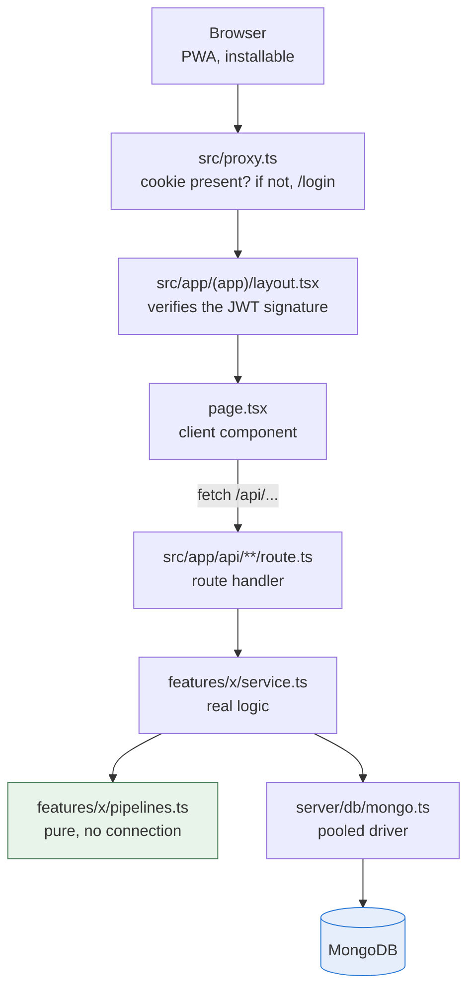
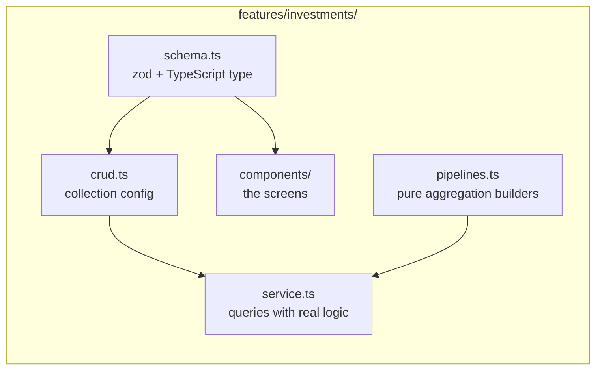
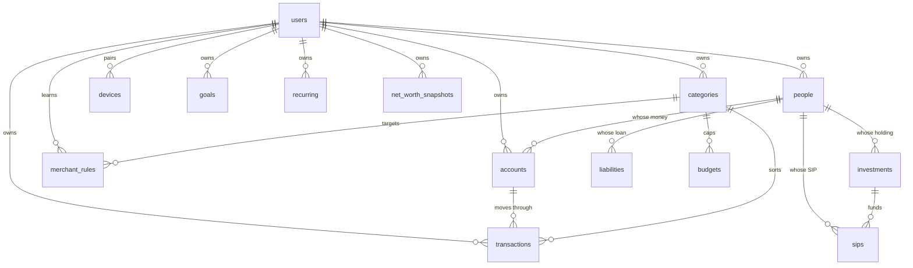
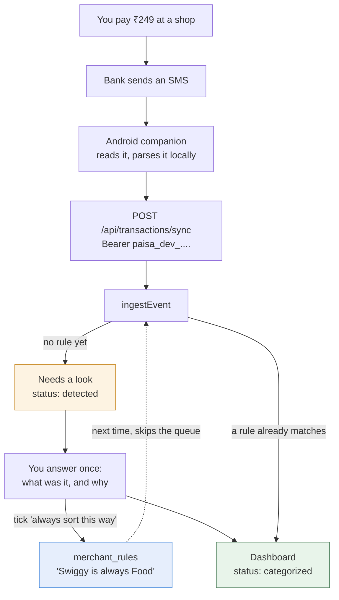
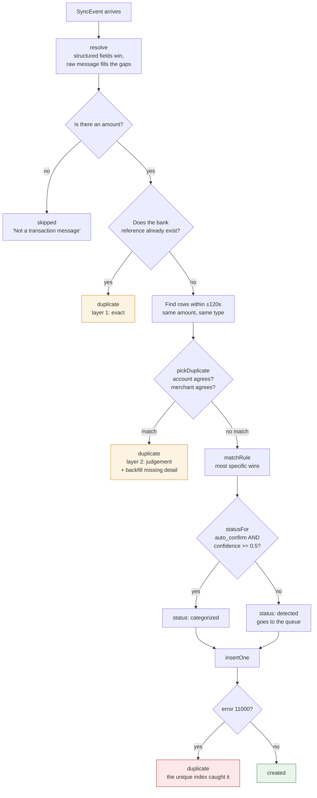
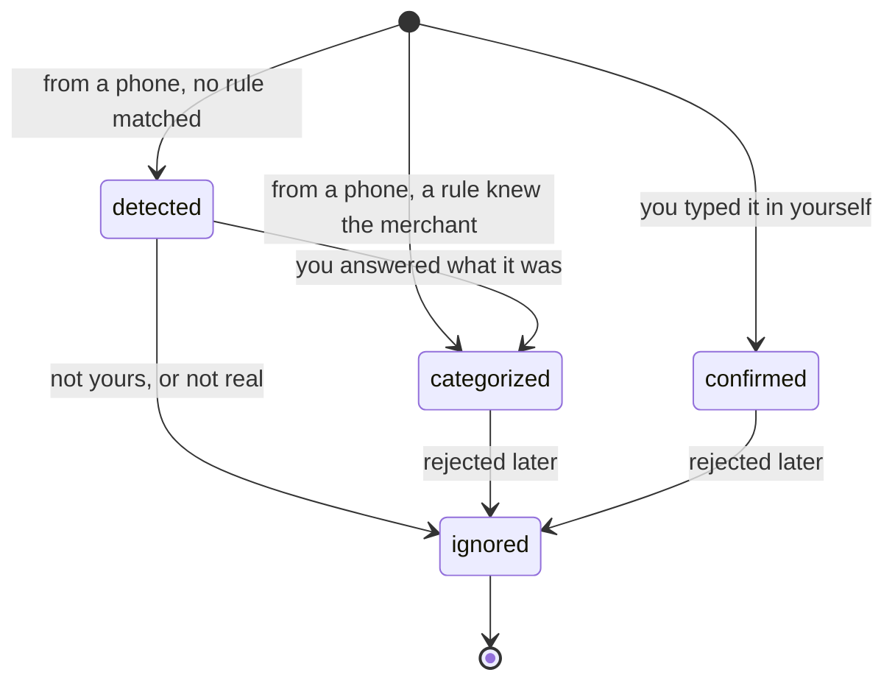
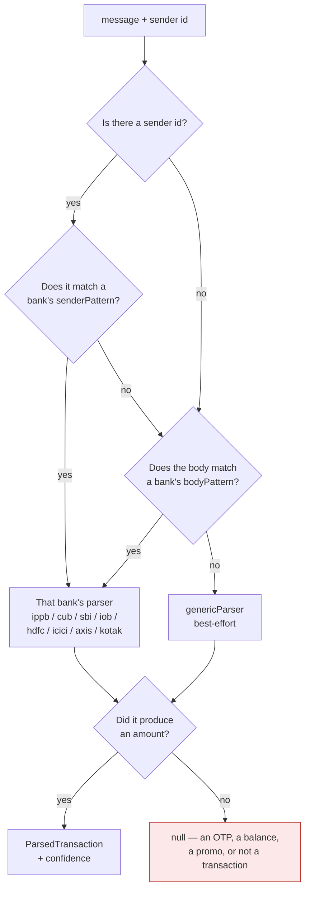
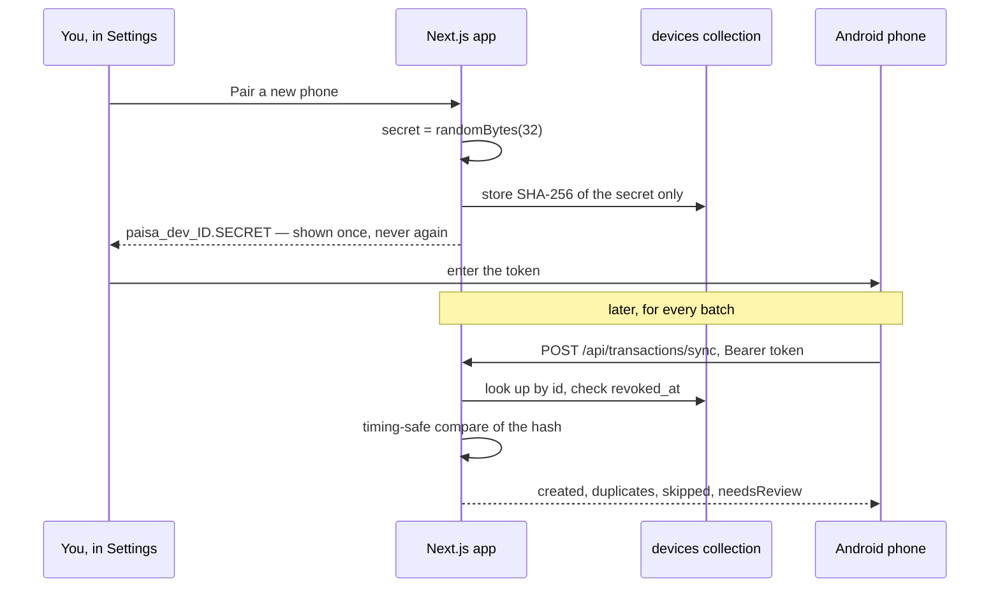
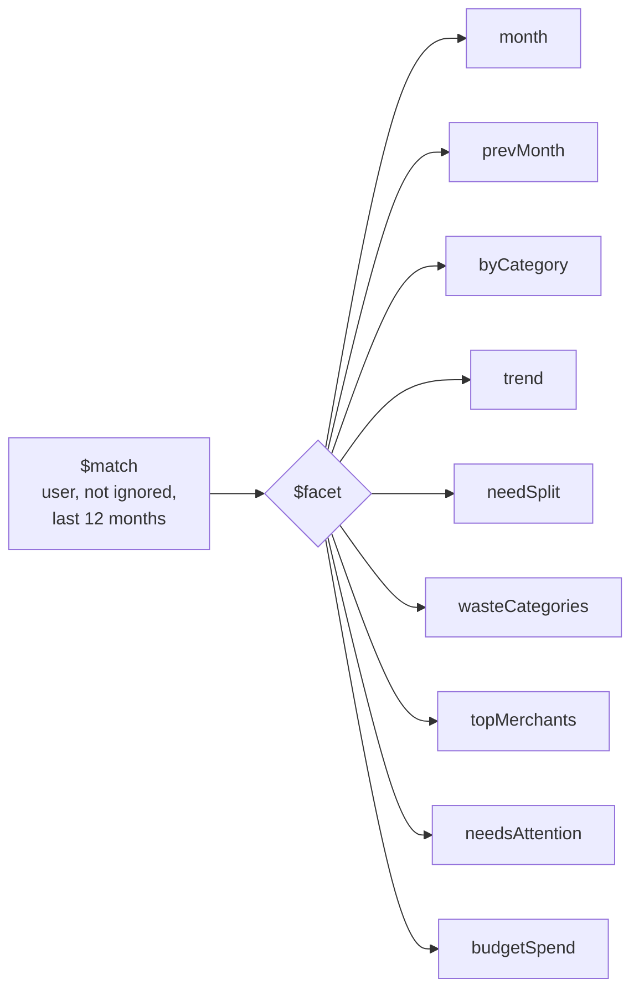

# Code map

Diagrams for reading this codebase. Start here, then go to the file the diagram
points at.

`ARCHITECTURE.md` explains *why* the code is shaped this way.
This file shows *where things are* and *what happens in what order*.

---

## Where to start reading

If you have fifteen minutes, read these five files in this order. They are the
spine; everything else hangs off them.

| # | File | Why it matters |
|---|---|---|
| 1 | `src/server/db/mongo.ts` | Every collection and document shape, in one file |
| 2 | `src/server/crud.ts` | How nine collections share four route handlers |
| 3 | `src/features/transactions/intelligence/sync.ts` | The most interesting logic in the app |
| 4 | `src/features/dashboard/pipelines.ts` | How nine queries became one `$facet` |
| 5 | `docs/ARCHITECTURE.md` | The reasoning behind all of the above |

---

## 1. The shape of the app

One Next.js project. No separate API server, no ORM, no state library.



The green box is the part worth noticing: **pipelines are pure**. They build a
MongoDB aggregation array and touch nothing else, which is why they can be
unit-tested without a database (`src/server/db/pipelines.test.ts`).

---

## 2. A feature folder

Every feature uses the same five names. Learn them once and you can read any
folder in the app.



**The rule:** a file in `features/x/` may import from `lib/`, `components/` and
`server/`. Two feature folders must not reach into each other's internals —
where they genuinely must, they import that feature's `service.ts`, which is
its public face.

---

## 3. The data model

14 collections. Every one carries `user_id`, and every generated query filters
on it.



Two things that surprise people:

- **Balances are never stored.** `accounts.opening_balance` plus a `$lookup`
  that sums everything that moved through the account. Editing a two-year-old
  transaction therefore corrects every screen, with no recalculation job.
- **MongoDB has no `ON DELETE CASCADE`.** The same rules live in a `CASCADES`
  map at the top of `src/server/crud.ts` — deleting a person unsets `person_id`
  across five collections, deleting a category clears its budgets and rules.

---

## 4. Transaction intelligence — the whole journey

This is the part worth understanding properly. A payment happens, and some
time later it appears on your dashboard, correctly sorted, without you typing
anything.



The dotted line is the point of the whole feature: **the queue should get
shorter over time.** Every answer you give teaches a rule, and a merchant with
a rule never reaches the queue again.

> The Android companion does not exist yet. Everything to the right of it is
> built and testable today — see `/sms-test` in the running app, which posts to
> the same endpoint.

---

## 5. `ingestEvent` — the decision tree

`src/features/transactions/intelligence/sync.ts`

This is the single most important function in the app, because it is the one
that can silently corrupt your data if it is wrong.



### Why deduplication has two layers

They are genuinely different problems:

| | Layer 1 | Layer 2 |
|---|---|---|
| Problem | The same message twice | The same payment on a different channel |
| Cause | Android re-delivers, or a queue is flushed twice | One ₹500 payment fires a GPay notification *and* a bank SMS |
| Shared reference? | Yes — UPI RRN, NEFT UTR, card auth code | No |
| Method | Exact lookup. No guessing | Judgement: same amount and type, within 120s, account and merchant that do not contradict |
| Where | `sync.ts`, plus the unique index | `dedupe.ts` → `pickDuplicate`, pure and unit-tested |

**The red box matters.** Layer 1 is a *read* then a *write*, so two copies of
the same SMS arriving in the same millisecond can both pass the read. The
partial unique index on `(user_id, raw_reference)` is what actually makes the
guarantee hold — application code cannot promise this, a database constraint
can.

An absent merchant or account **agrees with anything**, because one channel
usually carries detail the other lacks. And when a duplicate is found the later
message is not thrown away: it backfills whatever `merchant`, `account_last4`
or `raw_reference` the first one was missing.

Erring toward "not a duplicate" is the safe direction. A rejected real purchase
is annoying; a phantom ₹500 on your dashboard is worse.

---

## 6. Status lifecycle



`ignored` is not a delete. The row stays for the audit trail, and **every money
query in the app filters `status: { $ne: 'ignored' }`** — so a rejected row is
visible in history but is not money. If you add a new aggregate, that filter is
not optional.

---

## 7. Choosing a parser

`src/features/transactions/parsers/index.ts`



The sender id decides when available — it is the only part of an SMS a bank
cannot get wrong.

**The red box is the important outcome.** `my-banks.test.ts` is deliberately
weighted toward messages that must be **rejected**, because a one-time password
turned into a ₹5,000 spend is far worse than a spend you have to add by hand.

These parsers import nothing from React, Node or the database. That is
deliberate: the Android companion will use them unchanged.

---

## 8. Pairing a phone

`src/features/devices/service.ts`



The phone never holds your password. Only the hash is stored, so a database
dump cannot be replayed against the sync endpoint, and revoking a phone is one
field.

---

## 9. The dashboard in one pass

`src/features/dashboard/pipelines.ts`

Nine separate reads became one `$facet` over the same twelve months of rows.



One scan of the collection instead of nine. Each branch is an ordinary
pipeline, and all of them are executed against fixtures in
`src/server/db/pipelines.test.ts`.

---

## 10. Which tests cover what

```
src/features/fire/calc.test.ts                        FIRE maths
src/features/calculators/math.test.ts                 SIP, lumpsum, EMI
src/features/import/csv.test.ts                       statement column detection
src/features/transactions/parsers/parsers.test.ts     the generic reader
src/features/transactions/parsers/my-banks.test.ts    IPPB, CUB, SBI, IOB
src/features/transactions/intelligence/*.test.ts      dedupe and rules
src/server/db/pipelines.test.ts                       the real aggregations
```

`npm test` runs all of them and needs no database.

`npm run db:check` is the other half, and does need one — it proves the
guarantees the unit tests cannot: that the unique index is genuinely unique,
that a duplicate bank reference is rejected with error 11000, that money sums
cleanly, and that a failed transaction rolls back.
